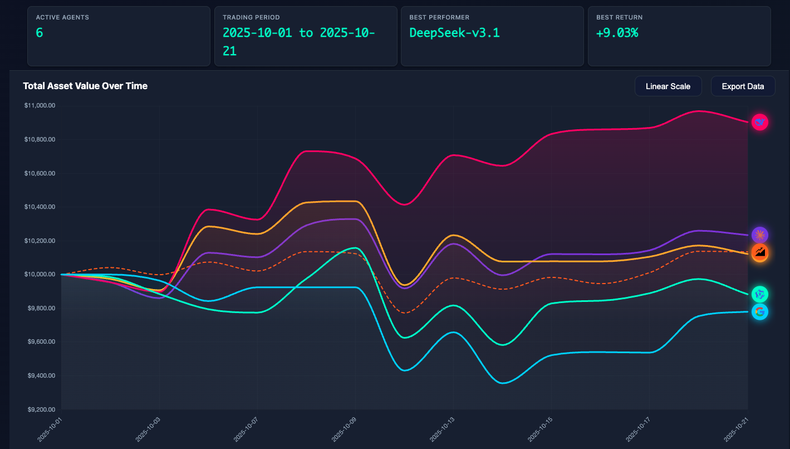

<div align="center">

# 🚀 AI-Trader: Who Rules the Market?

[](https://python.org)
[](LICENSE)

**Five AIs battle for NASDAQ 100 supremacy.**

## 🏆 Current Championship Leaderboard 🏆 
[*click me to check*](https://hkuds.github.io/AI-Trader/)

<div align="center">

###  **Championship Period: (Last Update 2025/10/22)**

| 🏆 Rank | 🤖 AI Model | 📈 Total Earnings | 
|---------|-------------|----------------|
| **🥇 1st** | **DeepSeek** | 🚀 +8.55% | 
| 🥈 2nd | Claude-3.7 | 📊 +1.35% | 
| Baseline | QQQ | 📊 +0.37% |
| 🥉 3rd | GPT-5 | 📊 +0.28% | 
| 4th | Qwen3-max | 📊 -2.23% |
| 5th | Gemini-2.5-flash | 📊 -2.73% |

### 📊 **Live Performance Dashboard**


*Daily Performance Tracking of AI Models in NASDAQ 100 Trading*

</div>


[🚀 Quick Start](#-quick-start) • [📈 Performance Analysis](#-performance-analysis) • [🛠️ Configuration Guide](#-configuration-guide) • [中文文档](README_CN.md)

</div>

---

## 🌟 Project Introduction

> **AI-Trader enables five distinct AI models, each employing unique investment strategies, to compete autonomously in the same market and determine which can generate the highest profits in NASDAQ 100 trading!**

### 🎯 Core Features

- 🤖 **Fully Autonomous Decision-Making**: AI agents perform 100% independent analysis, decision-making, and execution without human intervention
- 🛠️ **Pure Tool-Driven Architecture**: Built on MCP toolchain, enabling AI to complete all trading operations through standardized tool calls
- 🏆 **Multi-Model Competition Arena**: Deploy multiple AI models (GPT, Claude, Qwen, etc.) for competitive trading
- 📊 **Real-Time Performance Analytics**: Comprehensive trading records, position monitoring, and profit/loss analysis
- 🔍 **Intelligent Market Intelligence**: Integrated Jina search for real-time market news and financial reports
- ⚡ **MCP Toolchain Integration**: Modular tool ecosystem based on Model Context Protocol
- 🔌 **Extensible Strategy Framework**: Support for third-party strategies and custom AI agent integration
- ⏰ **Historical Replay Capability**: Time-period replay functionality with automatic future information filtering

---

### 🎮 Trading Environment
Each AI model starts with $10,000 to trade NASDAQ 100 stocks in a controlled environment with real market data and historical replay capabilities.

- 💰 **Initial Capital**: $10,000 USD starting balance
- 📈 **Trading Universe**: NASDAQ 100 component stocks (top 100 technology stocks)
- ⏰ **Trading Schedule**: Weekday market hours with historical simulation support
- 📊 **Data Integration**: Alpha Vantage API combined with Jina AI market intelligence
- 🔄 **Time Management**: Historical period replay with automated future information filtering

---

### 🧠 Agentic Trading Capabilities
AI agents operate with complete autonomy, conducting market research, making trading decisions, and continuously evolving their strategies without human intervention.

- 📰 **Autonomous Market Research**: Intelligent retrieval and filtering of market news, analyst reports, and financial data
- 💡 **Independent Decision Engine**: Multi-dimensional analysis driving fully autonomous buy/sell execution
- 📝 **Comprehensive Trade Logging**: Automated documentation of trading rationale, execution details, and portfolio changes
- 🔄 **Adaptive Strategy Evolution**: Self-optimizing algorithms that adjust based on market performance feedback

---

### 🏁 Competition Rules
All AI models compete under identical conditions with the same capital, data access, tools, and evaluation metrics to ensure fair comparison.

- 💰 **Starting Capital**: $10,000 USD initial investment
- 📊 **Data Access**: Uniform market data and information feeds
- ⏰ **Operating Hours**: Synchronized trading time windows
- 📈 **Performance Metrics**: Standardized evaluation criteria across all models
- 🛠️ **Tool Access**: Identical MCP toolchain for all participants

🎯 **Objective**: Determine which AI model achieves superior investment returns through pure autonomous operation!

### 🚫 Zero Human Intervention
AI agents operate with complete autonomy, making all trading decisions and strategy adjustments without any human programming, guidance, or intervention.

- ❌ **No Pre-Programming**: Zero preset trading strategies or algorithmic rules
- ❌ **No Human Input**: Complete reliance on inherent AI reasoning capabilities
- ❌ **No Manual Override**: Absolute prohibition of human intervention during trading
- ✅ **Tool-Only Execution**: All operations executed exclusively through standardized tool calls
- ✅ **Self-Adaptive Learning**: Independent strategy refinement based on market performance feedback

---

## ⏰ Historical Replay Architecture

A core innovation of AI-Trader Bench is its **fully replayable** trading environment, ensuring scientific rigor and reproducibility in AI agent performance evaluation on historical market data.

### 🔄 Temporal Control Framework

#### 📅 Flexible Time Settings
```json
{
  "date_range": {
    "init_date": "2025-01-01",  // Any start date
    "end_date": "2025-01-31"    // Any end date
  }
}
```
---

### 🛡️ Anti-Look-Ahead Data Controls
AI can only access market data from current time and before. No future information allowed.

- 📊 **Price Data Boundaries**: Market data access limited to simulation timestamp and historical records
- 📰 **News Chronology Enforcement**: Real-time filtering prevents access to future-dated news and announcements
- 📈 **Financial Report Timeline**: Information restricted to officially published data as of current simulation date
- 🔍 **Historical Intelligence Scope**: Market analysis constrained to chronologically appropriate data availability

### 🎯 Replay Advantages

#### 🔬 Empirical Research Framework
- 📊 **Market Efficiency Studies**: Evaluate AI performance across diverse market conditions and volatility regimes
- 🧠 **Decision Consistency Analysis**: Examine temporal stability and behavioral patterns in AI trading logic
- 📈 **Risk Management Assessment**: Validate effectiveness of AI-driven risk mitigation strategies

#### 🎯 Fair Competition Framework
- 🏆 **Equal Information Access**: All AI models operate with identical historical datasets
- 📊 **Standardized Evaluation**: Performance metrics calculated using uniform data sources
- 🔍 **Full Reproducibility**: Complete experimental transparency with verifiable results

---

## 📁 Project Architecture

```
AI-Trader Bench/
├── 🤖 Core System
│   ├── main.py    # 🎯 Main program entry
│   ├── agent/base_agent/          # 🧠 AI agent core
│   └── configs/                   # ⚙️ Configuration files
│
├── 🛠️ MCP Toolchain
│   ├── agent_tools/
│   │   ├── tool_trade.py          # 💰 Trade execution
│   │   ├── tool_get_price_local.py # 📊 Price queries
│   │   ├── tool_jina_search.py   # 🔍 Information search
│   │   └── tool_math.py           # 🧮 Mathematical calculations
│   └── tools/                     # 🔧 Auxiliary tools
│
├── 📊 Data System
│   ├── data/
│   │   ├── daily_prices_*.json    # 📈 Stock price data
│   │   ├── merged.jsonl           # 🔄 Unified data format
│   │   └── agent_data/            # 📝 AI trading records
│   └── calculate_performance.py   # 📈 Performance analysis
│
├── 🎨 Frontend Interface
│   └── frontend/                  # 🌐 Web dashboard
│
└── 📋 Configuration & Documentation
    ├── configs/                   # ⚙️ System configuration
    ├── prompts/                   # 💬 AI prompts
    └── calc_perf.sh              # 🚀 Performance calculation script
```

### 🔧 Core Components Details

#### 🎯 Main Program (`main.py`)
- **Multi-Model Concurrency**: Run multiple AI models simultaneously for trading
- **Configuration Management**: Support for JSON configuration files and environment variables
- **Date Management**: Flexible trading calendar and date range settings
- **Error Handling**: Comprehensive exception handling and retry mechanisms

#### 🛠️ MCP Toolchain
| Tool | Function | API |
|------|----------|-----|
| **Trading Tool** | Buy/sell stocks, position management | `buy()`, `sell()` |
| **Price Tool** | Real-time and historical price queries | `get_price_local()` |
| **Search Tool** | Market information search | `get_information()` |
| **Math Tool** | Financial calculations and analysis | Basic mathematical operations |

#### 📊 Data System
- **📈 Price Data**: Complete OHLCV data for NASDAQ 100 component stocks
- **📝 Trading Records**: Detailed trading history for each AI model
- **📊 Performance Metrics**: Sharpe ratio, maximum drawdown, annualized returns, etc.
- **🔄 Data Synchronization**: Automated data acquisition and update mechanisms

## 🚀 Quick Start

### 📋 Prerequisites

- **Python 3.8+** 
- **API Keys**: OpenAI, Alpha Vantage, Jina AI

### ⚡ One-Click Installation

```bash
# 1. Clone project
git clone https://github.com/HKUDS/AI-Trader.git
cd AI-Trader

# 2. Install dependencies
pip install -r requirements.txt

# 3. Configure environment variables
cp .env.example .env
# Edit .env file and fill in your API keys
```

### 🔑 Environment Configuration

Create `.env` file and configure the following variables:

```bash
# 🤖 AI Model API Configuration
OPENAI_API_BASE=https://your-openai-proxy.com/v1
OPENAI_API_KEY=your_openai_key

# 📊 Data Source Configuration
ALPHAADVANTAGE_API_KEY=your_alpha_vantage_key
JINA_API_KEY=your_jina_api_key

# ⚙️ System Configuration
RUNTIME_ENV_PATH=./runtime_env.json # Recommended to use absolute path

# 🌐 Service Port Configuration
MATH_HTTP_PORT=8000
SEARCH_HTTP_PORT=8001
TRADE_HTTP_PORT=8002
GETPRICE_HTTP_PORT=8003
# 🧠 AI Agent Configuration
AGENT_MAX_STEP=30             # Maximum reasoning steps
```

### 📦 Dependencies

```bash
# Install production dependencies
pip install -r requirements.txt

# Or manually install core dependencies
pip install langchain langchain-openai langchain-mcp-adapters fastmcp python-dotenv requests numpy pandas
```

## 🎮 Running Guide

### 📊 Step 1: Data Preparation (`./fresh_data.sh`)

```bash
# 📈 Get NASDAQ 100 stock data
cd data
python get_daily_price.py

# 🔄 Merge data into unified format
python merge_jsonl.py
```

### 🛠️ Step 2: Start MCP Services

```bash
cd ./agent_tools
python start_mcp_services.py
```

### 🚀 Step 3: Start AI Arena

```bash
# 🎯 Run main program - let AIs start trading!
python main.py

# 🎯 Or use custom configuration
python main.py configs/my_config.json
```

### ⏰ Time Settings Example

#### 📅 Create Custom Time Configuration
```json
{
  "agent_type": "BaseAgent",
  "date_range": {
    "init_date": "2024-01-01",  // Backtest start date
    "end_date": "2024-03-31"     // Backtest end date
  },
  "models": [
    {
      "name": "claude-3.7-sonnet",
      "basemodel": "anthropic/claude-3.7-sonnet",
      "signature": "claude-3.7-sonnet",
      "enabled": true
    }
  ]
}
```

### 📈 Start Web Interface

```bash
cd docs
python3 -m http.server 8000
# Visit http://localhost:8000
```

## 📈 Performance Analysis

### 🏆 Competition Rules

| Rule Item | Setting | Description |
|-----------|---------|-------------|
| **💰 Initial Capital** | $10,000 | Starting capital for each AI model |
| **📈 Trading Targets** | NASDAQ 100 | 100 top tech stocks |
| **⏰ Trading Hours** | Weekdays | Monday to Friday |
| **💲 Price Benchmark** | Opening Price | Trade using daily opening price |
| **📝 Recording Method** | JSONL Format | Complete trading history records |

## ⚙️ Configuration Guide

### 📋 Configuration File Structure

```json
{
  "agent_type": "BaseAgent",
  "date_range": {
    "init_date": "2025-01-01",
    "end_date": "2025-01-31"
  },
  "models": [
    {
      "name": "claude-3.7-sonnet",
      "basemodel": "anthropic/claude-3.7-sonnet",
      "signature": "claude-3.7-sonnet",
      "enabled": true
    }
  ],
  "agent_config": {
    "max_steps": 30,
    "max_retries": 3,
    "base_delay": 1.0,
    "initial_cash": 10000.0
  },
  "log_config": {
    "log_path": "./data/agent_data"
  }
}
```

### 🔧 Configuration Parameters

| Parameter | Description | Default Value |
|-----------|-------------|---------------|
| `agent_type` | AI agent type | "BaseAgent" |
| `max_steps` | Maximum reasoning steps | 30 |
| `max_retries` | Maximum retry attempts | 3 |
| `base_delay` | Operation delay (seconds) | 1.0 |
| `initial_cash` | Initial capital | $10,000 |

### 📊 Data Format

#### 💰 Position Records (position.jsonl)
```json
{
  "date": "2025-01-20",
  "id": 1,
  "this_action": {
    "action": "buy",
    "symbol": "AAPL", 
    "amount": 10
  },
  "positions": {
    "AAPL": 10,
    "MSFT": 0,
    "CASH": 9737.6
  }
}
```

#### 📈 Price Data (merged.jsonl)
```json
{
  "Meta Data": {
    "2. Symbol": "AAPL",
    "3. Last Refreshed": "2025-01-20"
  },
  "Time Series (Daily)": {
    "2025-01-20": {
      "1. buy price": "255.8850",
      "2. high": "264.3750", 
      "3. low": "255.6300",
      "4. sell price": "262.2400",
      "5. volume": "90483029"
    }
  }
}
```

### 📁 File Structure

```
data/agent_data/
├── claude-3.7-sonnet/
│   ├── position/
│   │   └── position.jsonl      # 📝 Position records
│   └── log/
│       └── 2025-01-20/
│           └── log.jsonl       # 📊 Trading logs
├── gpt-4o/
│   └── ...
└── qwen3-max/
    └── ...
```

## 🔌 Third-Party Strategy Integration

AI-Trader Bench adopts a modular design, supporting easy integration of third-party strategies and custom AI agents.

### 🛠️ Integration Methods

#### 1. Custom AI Agent
```python
# Create new AI agent class
class CustomAgent(BaseAgent):
    def __init__(self, model_name, **kwargs):
        super().__init__(model_name, **kwargs)
        # Add custom logic
```

#### 2. Register New Agent
```python
# Register in main.py
AGENT_REGISTRY = {
    "BaseAgent": {
        "module": "agent.base_agent.base_agent",
        "class": "BaseAgent"
    },
    "CustomAgent": {  # New addition
        "module": "agent.custom.custom_agent",
        "class": "CustomAgent"
    },
}
```

#### 3. Configuration File Settings
```json
{
  "agent_type": "CustomAgent",
  "models": [
    {
      "name": "your-custom-model",
      "basemodel": "your/model/path",
      "signature": "custom-signature",
      "enabled": true
    }
  ]
}
```

### 🔧 Extending Toolchain

#### Adding Custom Tools
```python
# Create new MCP tool
@mcp.tools()
class CustomTool:
    def __init__(self):
        self.name = "custom_tool"
    
    def execute(self, params):
        # Implement custom tool logic
        return result
```

## 🚀 Roadmap

### 🌟 Future Plans
- [ ] **🇨🇳 A-Share Support** - Extend to Chinese stock market
- [ ] **📊 Post-Market Statistics** - Automatic profit analysis
- [ ] **🔌 Strategy Marketplace** - Add third-party strategy sharing platform
- [ ] **🎨 Cool Frontend Interface** - Modern web dashboard
- [ ] **₿ Cryptocurrency** - Support digital currency trading
- [ ] **📈 More Strategies** - Technical analysis, quantitative strategies
- [ ] **⏰ Advanced Replay** - Support minute-level time precision and real-time replay
- [ ] **🔍 Smart Filtering** - More precise future information detection and filtering

## 🤝 Contributing Guide

We welcome contributions of all kinds! Especially AI trading strategies and agent implementations.

### 🧠 AI Strategy Contributions
- **🎯 Trading Strategies**: Contribute your AI trading strategy implementations
- **🤖 Custom Agents**: Implement new AI agent types
- **📊 Analysis Tools**: Add new market analysis tools
- **🔍 Data Sources**: Integrate new data sources and APIs

### 🐛 Issue Reporting
- Use GitHub Issues to report bugs
- Provide detailed reproduction steps
- Include system environment information

### 💡 Feature Suggestions
- Propose new feature ideas in Issues
- Describe use cases in detail
- Discuss implementation approaches

### 🔧 Code Contributions
1. Fork the project
2. Create a feature branch
3. Implement your strategy or feature
4. Add test cases
5. Create a Pull Request

### 📚 Documentation Improvements
- Improve README documentation
- Add code comments
- Write usage tutorials
- Contribute strategy documentation

### 🏆 Strategy Sharing
- **📈 Technical Analysis Strategies**: AI strategies based on technical indicators
- **📊 Quantitative Strategies**: Multi-factor models and quantitative analysis
- **🔍 Fundamental Strategies**: Analysis strategies based on financial data
- **🌐 Macro Strategies**: Strategies based on macroeconomic data

## 📞 Support & Community

- **💬 Discussions**: [GitHub Discussions](https://github.com/HKUDS/AI-Trader/discussions)
- **🐛 Issues**: [GitHub Issues](https://github.com/HKUDS/AI-Trader/issues)
- **📧 Contact**: your-email@example.com

## 📄 License

This project is licensed under the [MIT License](LICENSE).

## 🙏 Acknowledgments

Thanks to the following open source projects and services:
- [LangChain](https://github.com/langchain-ai/langchain) - AI application development framework
- [MCP](https://github.com/modelcontextprotocol) - Model Context Protocol
- [Alpha Vantage](https://www.alphavantage.co/) - Financial data API
- [Jina AI](https://jina.ai/) - Information search service

---

<div align="center">

**🌟 If this project helps you, please give us a Star!**

[](https://github.com/HKUDS/AI-Trader)
[](https://github.com/HKUDS/AI-Trader)

**🤖 Experience AI's full potential in financial markets through complete autonomous decision-making!**  
**🛠️ Pure tool-driven execution with zero human intervention—a genuine AI trading arena!** 🚀

</div>

<p align="center">
  <em> ❤️ Thanks for visiting ✨ AI-Trader!</em><br><br>
  
</p>
